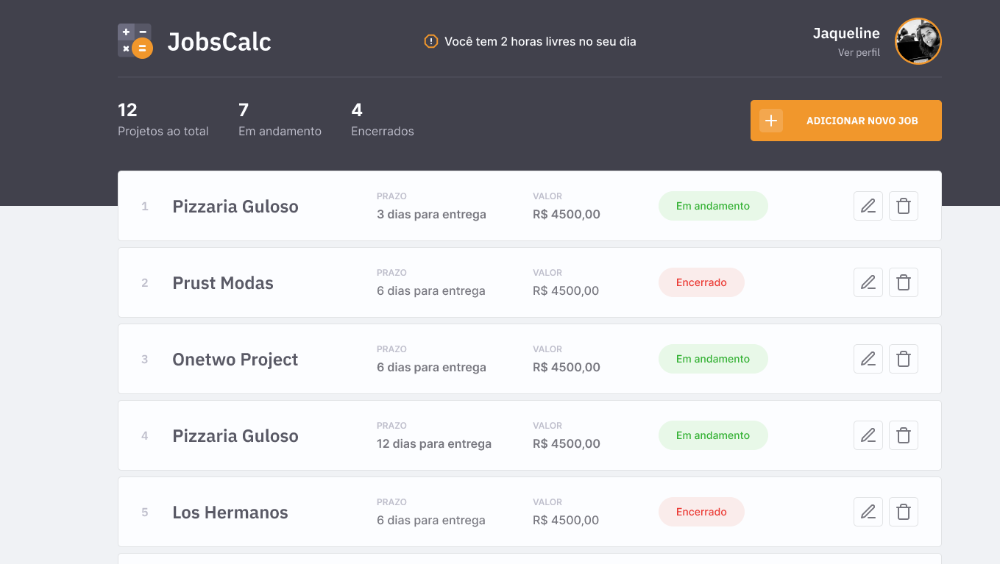

## JobsCalc

[](https://github.com/lucaslousada)
[](#)
[](#)
[](LICENCE.md)

O JobsCalc é uma aplicação de estimativa de cálculo para projetos freelancer, onde é possível cadastrar, editar e excluir jobs (projetos), obtendo uma estimativa de custo de cada job. Além disso, é possível traçar o valor da hora da pessoa que estará usando o sistema.

<p align="center">
  
</p>

## Tecnologias

Esse projeto foi desenvolvido com as seguintes tecnologias:

- HTML
- CSS
- JavaScript
- NodeJS
- EJS
- Express
- SQLite

## Layout

Você pode visualizar o layout do projeto através [desse link](https://www.figma.com/file/s4fytPFbDiSkv4GPSfKaLE/Jobs-Planning). É necessário ter conta no [Figma](https://figma.com) para acessá-lo.

## Iniciando

Você precisará instalar o Node.js e o NPM em seu computador.

```bash
$ git clone https://github.com/lucaslousada/jobs-calc.git
$ cd jobs-calc
$ npm i
$ npm run init-db
$ npm run dev
```
O aplicativo estará disponível para acesso em seu navegador em `http://localhost:3000`

## Licença

Esse projeto está sob a licença MIT. Veja o arquivo [LICENSE](LICENSE.md) para mais detalhes.