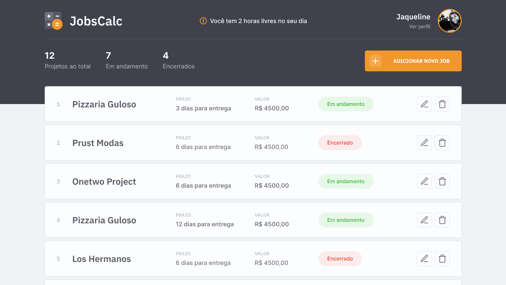

## JobsCalc

O JobsCalc é uma aplicação de estimativa de cálculo para projetos freelancer, onde é possível cadastrar, editar e excluir jobs (projetos), obtendo uma estimativa de custo de cada job. Além disso, é possível traçar o valor da hora da pessoa que estará usando o sistema.

Este projeto foi desenvolvido na segunda edição da maratona discover da Rocketseat.

[](https://github.com/lucaslousada)
[](#)
[](#)
[](#)
[](LICENSE.md)

<div>
  
</div>
<p align="center">
  Você pode visualizar o layout do projeto através <a href="https://www.figma.com/file/s4fytPFbDiSkv4GPSfKaLE/Jobs-Planning">deste link<a>.
</p>

## Tecnologias

Esse projeto foi desenvolvido com as seguintes tecnologias:

- HTML
- CSS
- JavaScript
- NodeJS
- EJS
- Express
- SQLite

## Executar o projeto

Você precisa instalar o [Git](https://git-scm.com/downloads) e o [Node.js](https://nodejs.org/en/download/) para executar este projeto.
Você pode usar [Yarn](https://yarnpkg.com/) ou [Npm](https://nodejs.org/en/download/).

```bash
# Clone o projeto e acesse a pasta
$ git clone https://github.com/lucaslousada/jobs-calc.git && cd jobs-calc
# Instale as dependências
$ npm i
# Crie o banco de dados
$ npm run init-db
# Inicie o servidor com
$ npm run dev
```

Aplicação: http://localhost:3000

## Licença

Esse projeto está sob a licença MIT. Veja o arquivo [LICENSE](LICENSE.md) para mais detalhes.
